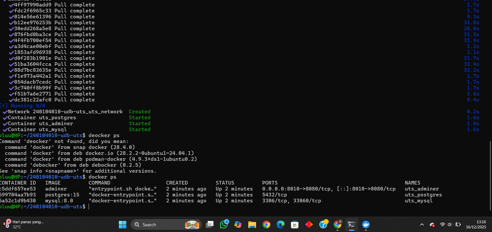
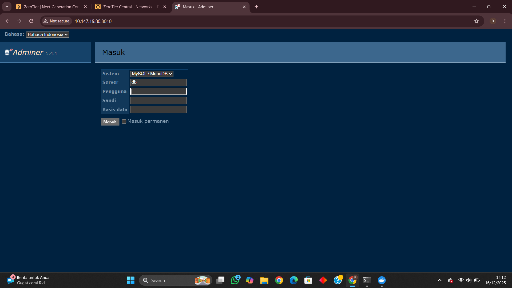
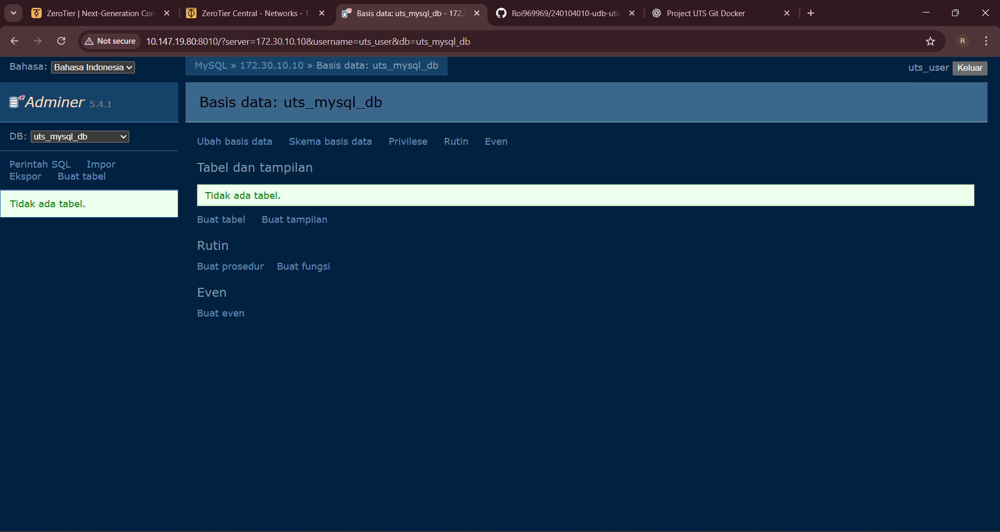
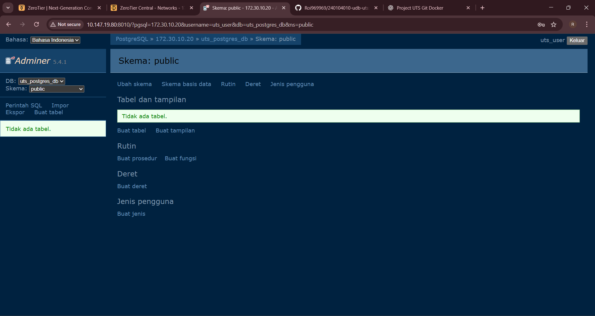

# UTS Docker – Database & Adminer

## Identitas Mahasiswa

* **Nama** : Roikhan Nur Fauzi
* **NIM** : 240104010

---

## Administrator Port

* **Adminer** : `8010`
* **MySQL** : `3306`
* **PostgreSQL** : `5432`

---

## IP ZeroTier

* **IP ZeroTier** : 10.147.19.80

---

## Cara Menjalankan Project

1. Clone repository:

   ```
   git clone https://github.com/roi969969/240104010-udb-uts
   ```
2. Masuk ke folder project:

   ```
   cd 240104010-udb-uts
   ```
3. Jalankan Docker Compose:

   ```
   docker compose up -d
   ```
4. Pastikan container berjalan:

   ```
   docker ps
   ```

---

## Akses Adminer

Buka browser:

```
http://IP_ZEROTIER:8080
```

### Login Adminer ke MySQL

* **System** : MySQL
* **Server** : mysql
* **Username** : root
* **Password** : root
* **Database** : (kosongkan / isi sesuai kebutuhan)

### Login Adminer ke PostgreSQL

* **System** : PostgreSQL
* **Server** : uts_postgres
* **Username** : postgres
* **Password** : postgres
* **Database** : postgres

---

## Tangkapan Layar (Wajib)

Lampirkan screenshot berikut:

1. Output `docker ps`
2. Adminer diakses melalui IP ZeroTier
3. Login Adminer ke MySQL (berhasil)
4. Login Adminer ke PostgreSQL (berhasil)

## ScreenShot








